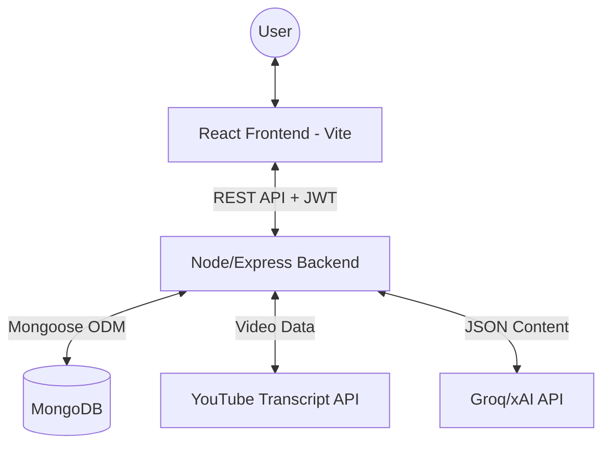

# YouTube Tutor - System Architecture

The YouTube Tutor application is built using a modern **MERN-like** stack with a heavy focus on **AI-driven content synthesis**.

## High-Level Architecture

## Core Components

### 1. Frontend (React + Tailwind + Lucide)
- **State Management**: React Context (`AuthContext`) for user session.
- **Data Fetching**: Axios-based service layer (`api.ts`) with automatic JWT injection.
- **Key Pages**:
    - `Dashboard`: Lists analyzed videos.
    - `VideoView`: Interactive view for summaries, quizzes, and clarifications.
    - `Analyze`: Video processing trigger.

### 2. Backend (Node.js + Express + TypeScript)
- **Services**:
    - `aiService`: Handles provider detection (Groq/xAI), "Pure API" mode logic, and data normalization (JSON smoothing).
    - `youtubeService`: Extracts transcripts and video metadata.
    - `exportService`: Generates PDF (PDFKit) and DOCX (docx.js) reports.
- **Middleware**:
    - `auth`: JWT verification and user request enrichment.

### 3. Data Storage (MongoDB)
- **Videos**: Stores transcript, metadata, and topic clusters.
- **Summaries**: Tiered content (short/medium/detailed).
- **Questions**: Multi-type assessment data.
- **Clarifications**: AI-explained terminology and reasoning.

## Analysis Flow: "From URL to Insights"
1. **Request**: User submits a YouTube URL.
2. **Extraction**: Backend fetches the transcript via `youtube-transcript`.
3. **AI Synthesis**: 
   - `aiService` calls Groq (Llama 3.3) or xAI (Grok-Beta).
   - Responses are normalized via **Data Smoothing** to ensure they fit the DB schema.
4. **Persistence**: Structured results are saved across multiple collections.
5. **Interactive Learning**: User viewstiered summaries and takes AI-generated quizzes.
6. **Export**: User downloads a comprehensive report via authenticated blob download.

---
*Created by YouTube Tutor AI*
